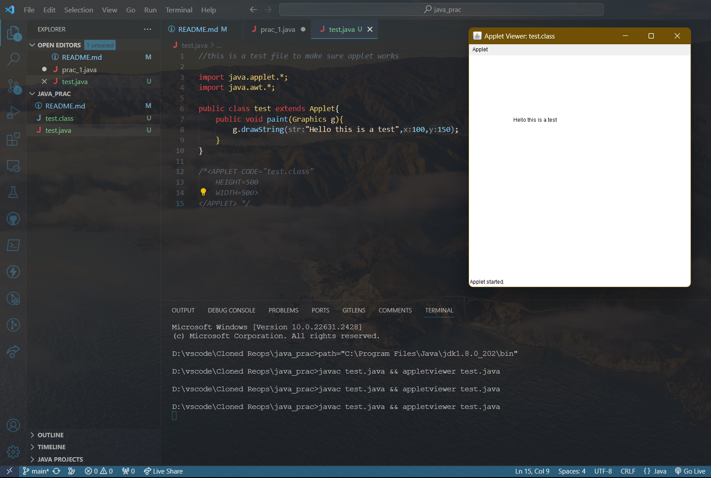
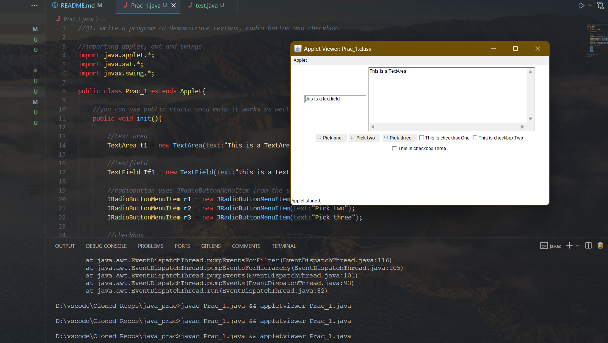

# java_prac

### Read the readme

## the questions will be commented on the first line

the code will work "hopefully"..

made sure to include the output screenshot as well.

**#test.java**

**practical 1**

